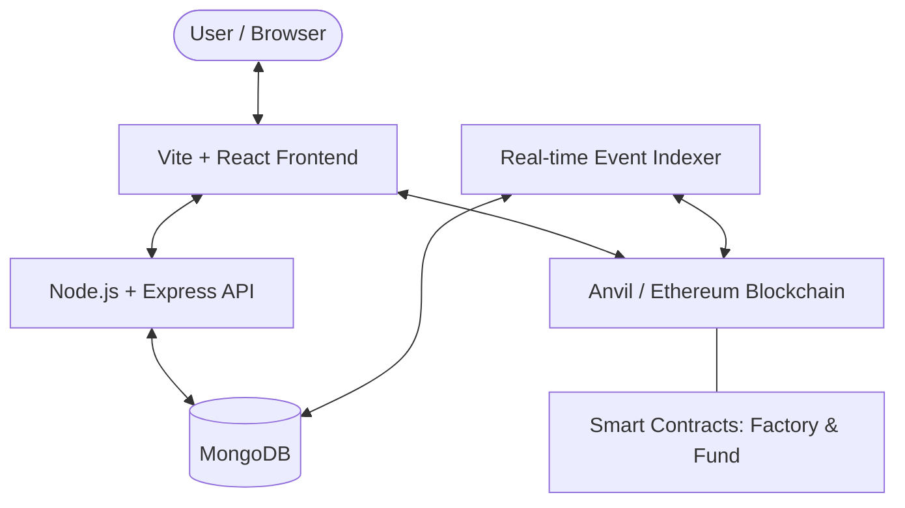

# GoFundChain Protocol

GoFundChain is a decentralized crowdfunding platform built on Ethereum. It allows creators to launch funding campaigns with transparent, on-chain rules, and enables donors to contribute securely using ETH.

## Architecture Overview

The system follows a modern Web3 architecture, combining decentralized smart contracts with a high-performance off-chain indexing layer for a seamless user experience.



### 1. Smart Contract Layer (The Source of Truth)
- **FundFactory**: A singleton contract that deploys individual `Fund` instances. It keeps track of all projects created on the protocol.
- **Fund**: Individual non-custodial contracts for each campaign. They handle deposits, goal tracking, and deadline enforcement autonomously.

### 2. Indexer & Backend (Real-time Discovery)
- **Indexer**: Monitors the blockchain for `FundCreated`, `Funded`, and `Withdrawn` events. It syncs on-chain data into MongoDB to enable instant search and high-speed global analytics.
- **REST API**: Provides structured data to the frontend, including aggregated platform statistics for the Admin Dashboard and complex search queries.

### 3. Frontend (Premium Experience)
- A sleek, responsive dashboard built with **React**, **Tailwind CSS**, and **Lucide Icons**.
- Integrated with **Ethers.js** for direct blockchain interaction and **Metamask** for secure transaction signing.

---

## Key Features

- **Decentralized Creation**: Anyone can launch a fund by specifying a name, description, goal, and duration.
- **On-Chain Descriptions**: Project missions are stored directly on the blockchain, ensuring immutable context.
- **Admin Command Center**: A management dashboard for the protocol deployer with global funding analytics.
- **Real-time Search**: Instant discovery of funds by name, address, or description keywords.
- **Premium UI/UX**: Custom design system featuring emerald-themed aesthetics, glassmorphism, and optimized scrollbar experiences.

---

## Project Structure

```bash
├── smartcontracts2.0/   # Hardhat + Viem contract development & deployment
├── funding-frontend/    # Vite + React frontend application
├── backend/             # Node.js API + MongoDB Indexer
├── LOCAL_SETUP.md       # Step-by-step local execution guide
└── README.md            # Project architecture and overview
```

---

## Getting Started

To run this project locally, please refer to the detailed [LOCAL_SETUP.md](file:///home/dulshan/GoFundMe/LOCAL_SETUP.md) guide.

## License
MIT License - Developed for decentralized transparency.
